# Video Maker — Architecture & Flow

Full picture of how the system works today, what's broken, and where it's going.

---

## 1. Full Pipeline (Bird's Eye View)

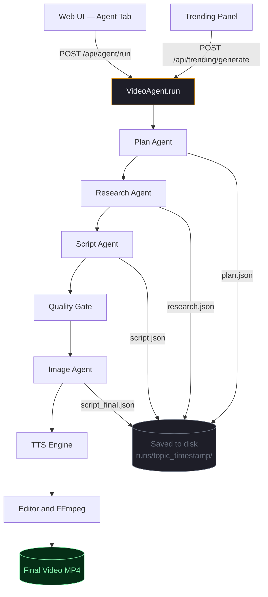

---

## 2. Plan Agent

Turns a free-text prompt into a structured plan the rest of the pipeline reads.

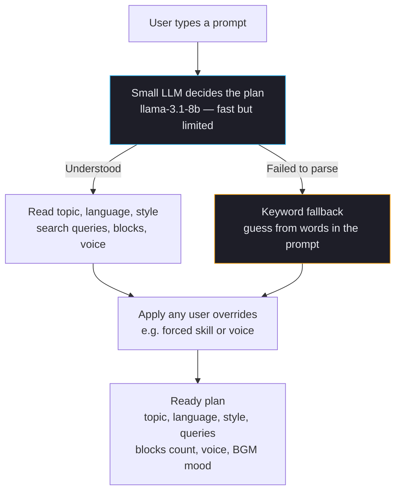

**What the plan contains:**
- Topic, language (English / Vietnamese), style, topic category
- Up to 8 search queries for research
- Number of script blocks (3–10), image display mode, voice, BGM mood

**⚠ Known problems:**
- The 8b model is too small — it misreads complex prompts and gets language wrong for mixed-language topics
- If LLM fails, the keyword fallback runs silently with no warning to the user
- The plan is invisible — user can't review or adjust queries before research starts

**💡 Improvements:**
- Use the 70b model for planning, or enforce a structured JSON output schema so parsing never fails
- Show the plan in the UI as a "confirm before research" step — let the user edit queries
- Surface a warning banner if the fallback was used

---

## 3. Research Agent

Gathers facts from the web. Three stages: search → crawl → extract.

### How it works today

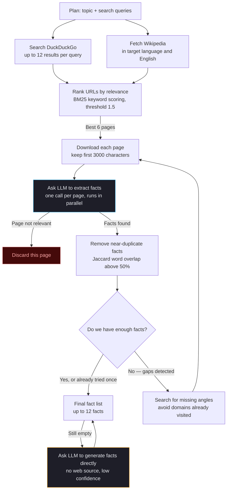

**⚠ Known problems:**
- Gap-filling loop only runs once — misses multiple research holes in one pass
- Pages are cut off at 3000 characters — the most specific facts are often in the second half of an article
- BM25 threshold 1.5 is too aggressive — drops useful pages that mention the topic indirectly
- LLM fallback makes up facts with no source URL and a low confidence score of 0.3
- Wikipedia always fetches English even when the topic is already in English (wasted API call)
- Hard cap of 12 facts — fine for simple topics, too few for dense lore

### Proposed future architecture — Agentic RAG with Vector Store

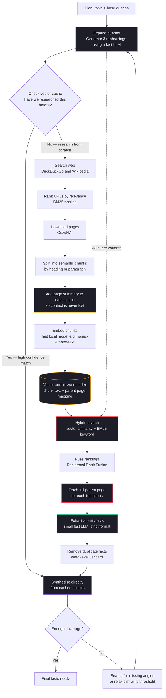

**What this solves vs today:**
- Semantic cache avoids re-researching the same topic (e.g. Naruto lore fetched last week)
- Contextual chunk enrichment means each chunk knows which page and section it came from — no more truncation blindness
- Hybrid search recalls facts that keyword-only BM25 misses
- Parent document retrieval gives the LLM full context, not just the matching snippet
- Reflection loop can run multiple times and lower the threshold instead of giving up

---

## 4. Script Agent

Turns the fact list into a narrated script, then checks and optionally rewrites it.

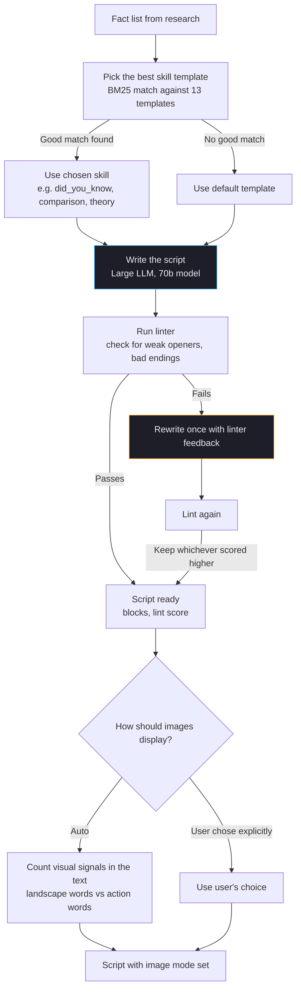

**⚠ Known problems:**
- Rewrite happens only once — if the second attempt is also bad, the better of two mediocre scripts ships
- Image mode inference counts keywords naively — "ocean" in a political script still triggers background mode
- Vietnamese validation rejects scripts with English proper nouns (character names, titles)
- No tracking of which facts were actually used — high-score facts can be silently ignored

**💡 Improvements:**
- Show lint issues in the UI so the user can fix them manually
- Replace image mode inference with an explicit toggle in the UI
- Log unused facts so the user can see what got left on the cutting room floor

---

## 5. Quality Gate

Five yes/no questions asked by a judge LLM. Script rewrites if it fails.

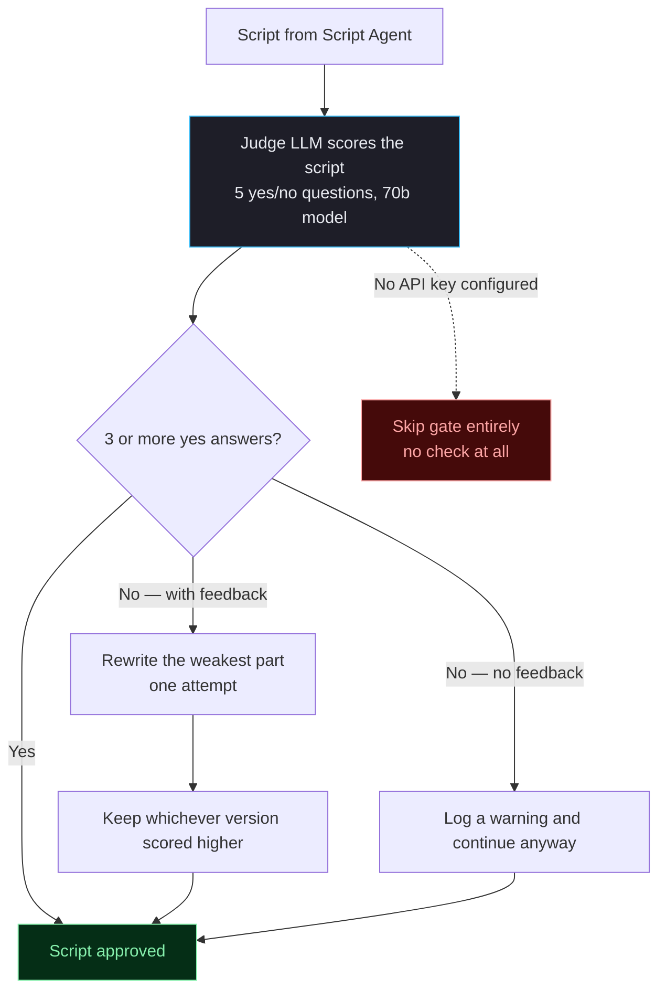

**The 5 questions:**
1. Does the hook open with a shocking fact, bold claim, or curiosity gap?
2. Does it reveal hidden details rather than summarise basic plot?
3. Is there at least one fact a knowledgeable fan wouldn't already know?
4. Does the last sentence loop back to the opening for replay?
5. Does tension escalate — each revelation more surprising than the last?

**⚠ Known problems:**
- Threshold of 3/5 means a script can fail two questions and still ship
- The judge's feedback is never shown to the user
- Gate skips entirely when no API key is set — no warning, no fallback check
- Same five questions for all skill types — a comedy script shouldn't be judged on lore depth

**💡 Improvements:**
- Show the N/5 score in the UI progress bar (green above 4, yellow at 3, red below)
- Surface the weakest-part feedback so the user can manually fix it
- Define per-skill question sets — comedy checks absurdity and timing, dark_secrets checks reveal depth

---

## 6. Image Agent

Finds and attaches images to each script block.

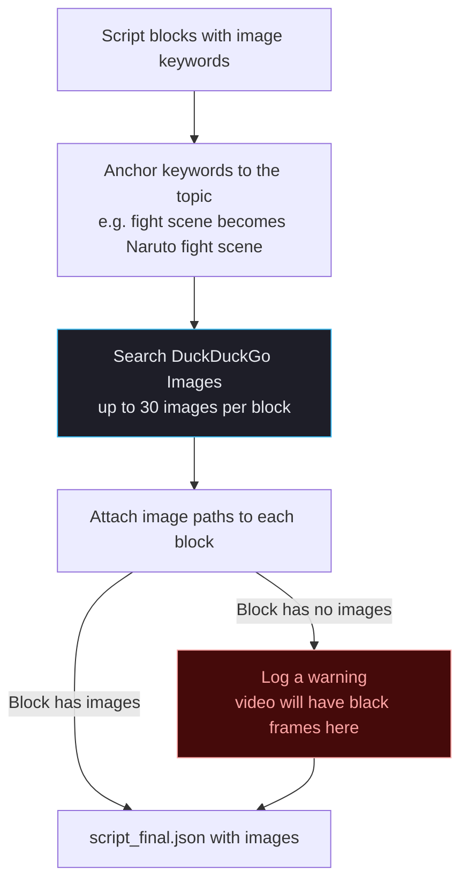

**⚠ Known problems:**
- Only searches DuckDuckGo — no fallback if DDG blocks the request or returns irrelevant results
- No quality filter — blurry, watermarked, and portrait images all pass through
- Empty image blocks produce black frames in the video instead of stopping with an error
- Downloads 30 images per block but the editor uses only a few — wasteful

**💡 Improvements:**
- Add Wikipedia Commons as a second source for historical and factual topics
- Hard-stop the pipeline when a block has zero images — surface a clear error to the user
- Filter out portrait images when display mode is background

---

## 7. TTS Engine

Converts script text to speech in parallel chunks, then corrects timing drift.

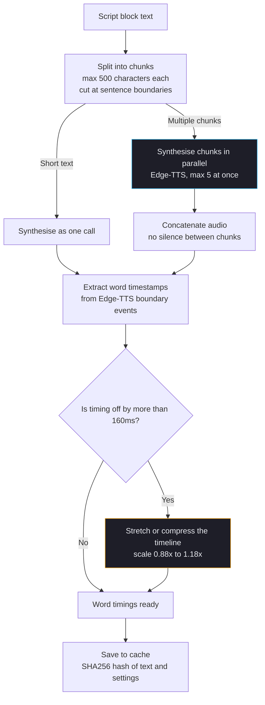

**⚠ Known problems:**
- Max concurrent chunks (5) is hardcoded — should be in the profile
- Edge-TTS is the only engine — if Microsoft throttles it, there is no fallback
- Switching alignment mode doesn't invalidate the cache — stale results can be used
- Drift correction range (0.88–1.18x) may not be wide enough for very long blocks

**💡 Improvements:**
- Move the concurrency limit to `profiles/default.json`
- Add ElevenLabs or Kokoro as an optional fallback TTS engine
- Include alignment mode in the cache key

---

## 8. Editor and Renderer

Composes subtitles, images, audio, and background into a final video.

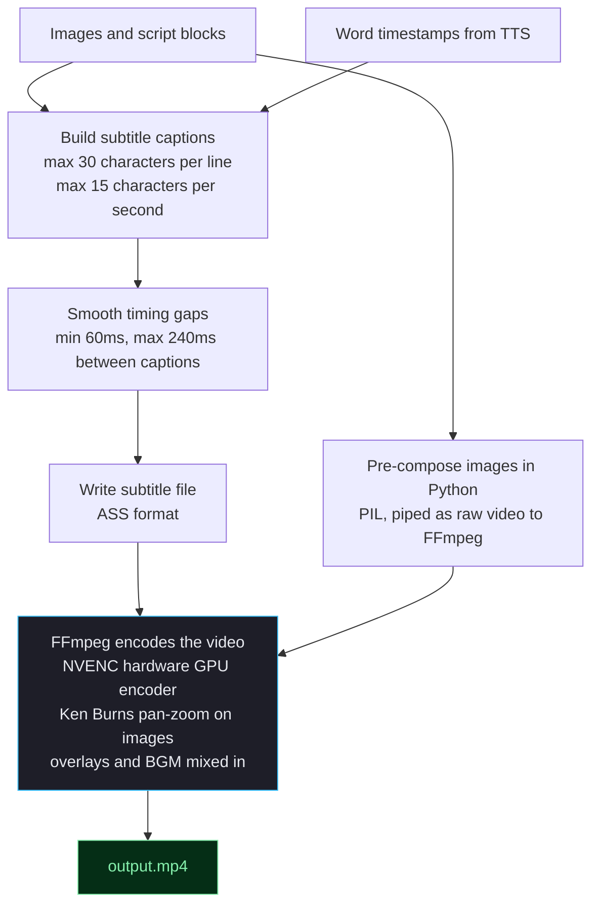

**⚠ Known problems:**
- Requires an NVIDIA GPU — no CPU fallback if NVENC is unavailable
- BGM is a random pick based on mood — user can't choose a specific track or preview it
- Subtitle preset (minimal / energetic / cinematic) is locked to minimal — the other presets exist but aren't exposed in the UI

**💡 Improvements:**
- Add x264 CPU encode path as fallback when NVENC is not available
- Let user pick the subtitle preset in the Agent UI
- BGM preview panel before generating

---

## 9. Trend Discovery

Finds what anime is trending right now and brainstorms video angles for it.

### How it works today

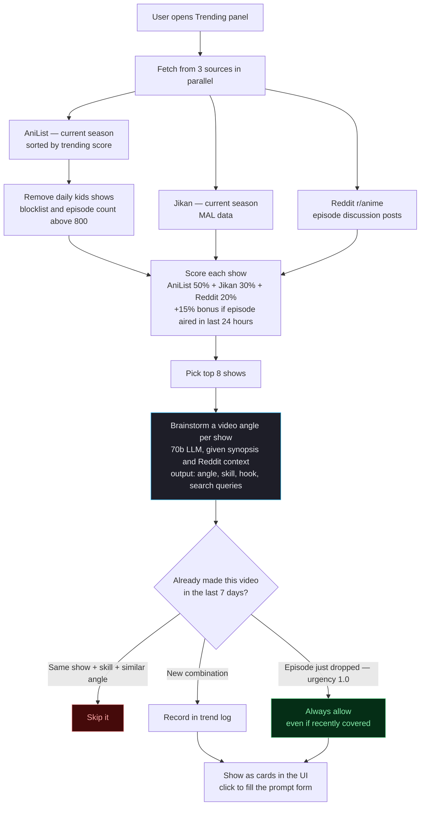

**⚠ Known problems:**
- AniList seasonal trending still surfaces Precure and AiPri above mainstream shows — popularity is not considered
- Jikan and AniList classify multi-cour shows differently, so the MAL ID cross-match rarely works
- Reddit posts use romanized titles (e.g. Shingeki no Kyojin) while AniList uses English (Attack on Titan) — fuzzy match fails
- 5 second timeout is too short for Jikan which rate-limits aggressively
- Only anime is implemented — all other categories silently return nothing

### Proposed future architecture — Semantic Cache + Agentic Brainstorm

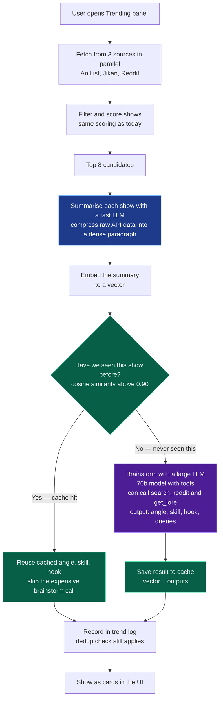

**What this solves vs today:**
- Fast LLM summarisation makes caching practical — compare embeddings, not raw API JSON
- Cache hit avoids the 70b brainstorm call for shows covered recently — much faster refresh
- Large LLM with tools can look up Reddit threads and wiki lore before committing to an angle — richer, more accurate hooks

**💡 Near-term improvements (without the full cache rebuild):**
- Use AniList `popularity` score as a tiebreaker when trending scores tie
- Increase Jikan timeout to 10s with one retry
- Surface `trending_reason` and `hook_idea` text on each card (currently hidden)
- Add a second category — gaming via IGDB or music via Billboard

---

## 10. LLM Routing

Every LLM call goes through a central client that picks the right model and handles failures.

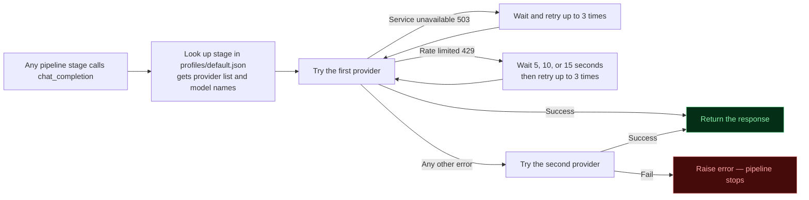

**Stage to model mapping:**

| Stage | Primary | Fallback | Model size |
|---|---|---|---|
| script, quality_gate, refine, research | Groq | Gemini | 70b |
| research_extract | Groq | Gemini | 70b / 27b |
| plan, crawl, interest_rank, bank_extract, research_eval | Groq only | — | 8b |
| trend_brainstorm | Groq only | — | 70b |

**⚠ Known problems:**
- If Groq rate-limits during research, each retry blocks the pipeline for 5–15 seconds before falling through to Gemini
- Gemini fallback uses `gemma-3-27b-it` which is bad at returning valid JSON — causes frequent parse failures
- No circuit breaker — if Groq is down, every call still tries Groq first and waits through all retries

**💡 Improvements:**
- Circuit breaker: after 3 consecutive failures, flip provider order for the rest of the session
- Swap `gemma-3-27b-it` for `gemini-2.0-flash` — same speed, dramatically better JSON compliance
- Show provider health (green / yellow / red) in the UI status bar

---

## 11. Full Data Flow — Stage by Stage

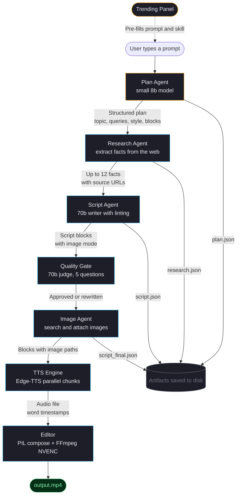

---

## 12. Known Problems

| # | Where | What breaks | How bad |
|---|---|---|---|
| 1 | Plan | 8b model misreads complex topics and language | Medium |
| 2 | Plan | User can't review or edit the plan before research starts | Medium |
| 3 | Research | Gap-fill loop only runs once | Low |
| 4 | Research | Long articles truncated at 3000 chars — best facts cut off | Medium |
| 5 | Research | LLM fallback facts have no source URL | Low |
| 6 | Script | Lint rewrite only tried once | Low |
| 7 | Script | Image mode inferred by naive keyword count | Low |
| 8 | Quality gate | Score never shown to user | Medium |
| 9 | Quality gate | Same 5 questions for every skill type | Medium |
| 10 | Images | DuckDuckGo only — no fallback source | Medium |
| 11 | Images | Empty block produces black frames, no hard error | High |
| 12 | Editor | Requires NVIDIA GPU — no CPU path | Medium |
| 13 | Editor | Subtitle preset stuck on minimal — others hidden | Low |
| 14 | TTS | Parallel chunk limit hardcoded, not in profile | Low |
| 15 | LLM | No circuit breaker when primary provider is down | Medium |
| 16 | LLM | Gemini fallback model returns bad JSON frequently | Low |
| 17 | Trending | Jikan and AniList almost never share the same shows | Low |
| 18 | Trending | Only anime is implemented | Medium |
| 19 | Trending | 5s timeout too tight for Jikan | Low |

---

## 13. Roadmap

### Quick wins — under a day each
- [ ] Show quality gate score (N/5) in the UI progress pipeline
- [ ] Add subtitle preset picker to the Agent UI
- [ ] Swap Gemini fallback from `gemma-3-27b-it` to `gemini-2.0-flash`
- [ ] Move TTS parallel chunk limit to `profiles/default.json`
- [ ] Increase Jikan timeout to 10s with one retry

### Medium — 1 to 3 days
- [ ] Plan review step in UI — show topic, queries, and chosen skill before research runs
- [ ] Wikipedia Commons as a second image source for factual topics
- [ ] Per-skill quality gate questions (comedy, dark_secrets, lore_deep_dive each need different criteria)
- [ ] Surface `trending_reason` and `hook_idea` text on trending cards
- [ ] Add a second trending category (gaming via IGDB or music via Billboard)

### Larger — 3 or more days
- [ ] **Agentic RAG for research** — semantic chunking, vector store, hybrid search, parent document retrieval (see Section 3 proposed diagram)
- [ ] **Semantic cache for trending** — embed show summaries, skip the 70b brainstorm call on cache hit (see Section 9 proposed diagram)
- [ ] Circuit breaker for LLM providers — flip order after 3 consecutive failures
- [ ] Hard stop on empty image blocks with a clear user-facing error
- [ ] CPU encode fallback (x264) for machines without NVIDIA GPU
- [ ] ElevenLabs or Kokoro as a fallback TTS engine
