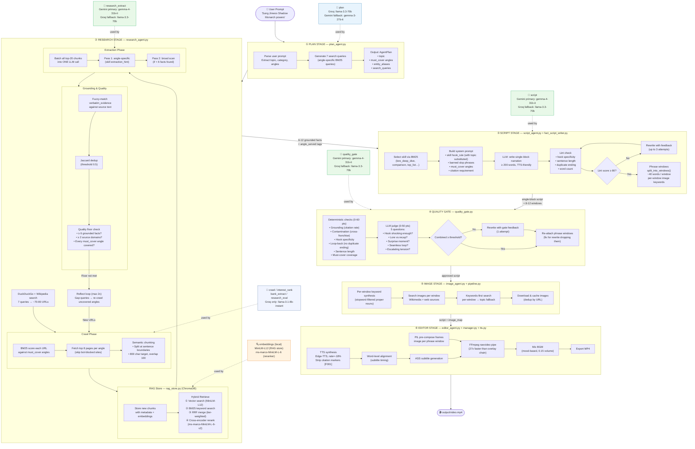
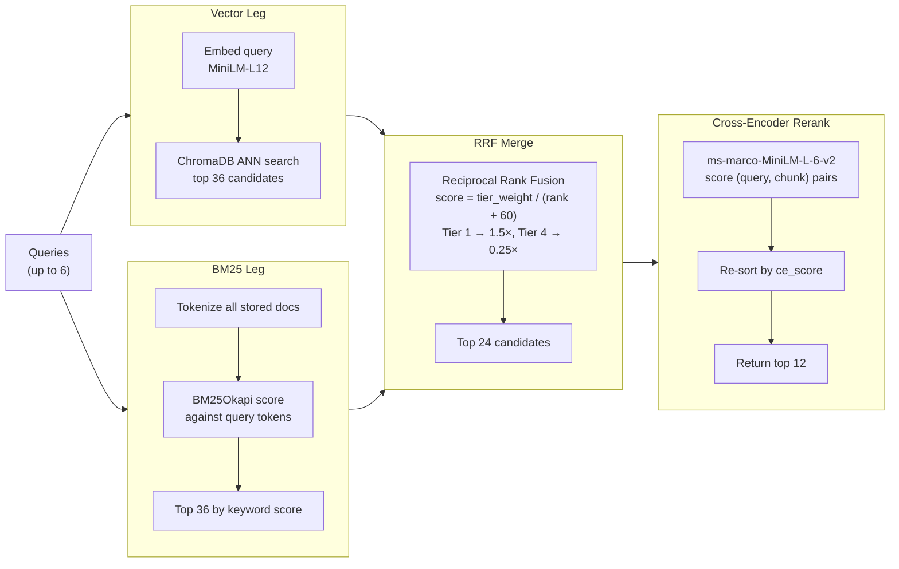

# Video Maker — Full Pipeline Flow

---

## RAG Retrieval Detail

---

## Known Issues & Future Work

| Area | Issue | Fix |
|------|-------|-----|
| Rate limits | `crawl`, `interest_rank`, `bank_extract`, `research_eval` all hit Groq 8B rate limit | Move to local Ollama E2B/E4B |
| Image validation | No check if downloaded image is actually relevant | Use Ollama E4B vision to score images |
| RAG duplicate IDs | Same URL processed across runs causes `upsert` warning | Deduplicate by URL hash before upsert |
| Research facts quality | Small 8B model for extraction misses subtle facts | Use gemma-4-31b-it for extraction (partially done) |
| Script ending | Loop-back sometimes copies hook verbatim | Duplicate ending penalty added to gate |
