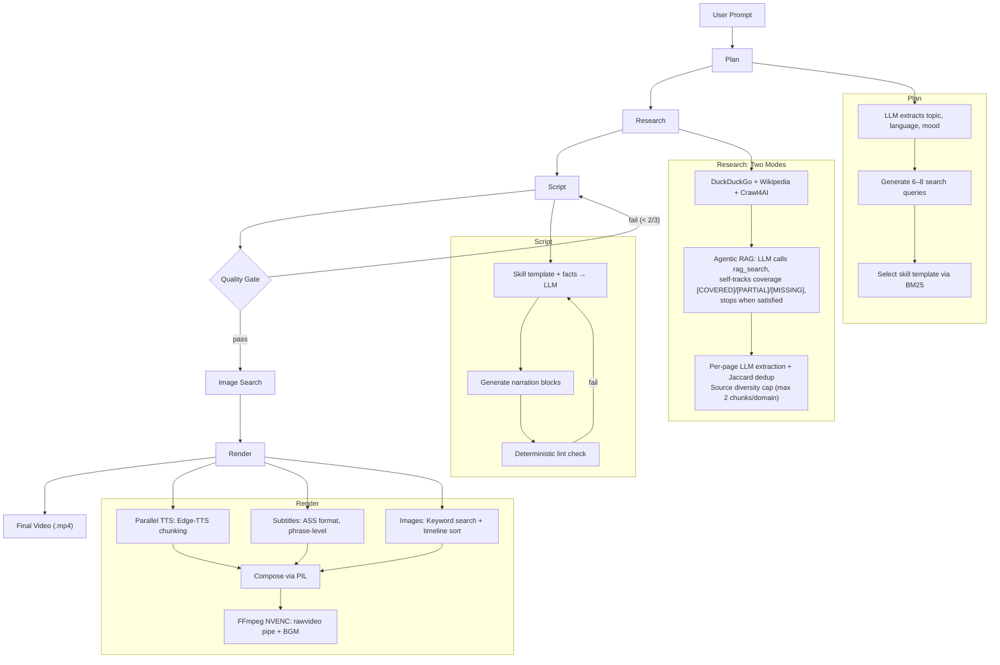

# Video Maker

An autonomous AI pipeline that transforms a free-form text prompt into a fully rendered YouTube Shorts video — complete with narration, timed subtitles, topic-matched images, and background music. No manual steps, no editing required.

**Input:** `"Hakari's cursed technique in JJK"`  
**Output:** A 1080×1920 vertical video with word-timed subtitles, scraped images sorted to match narration, parallel TTS narration, and mood-matched background music.

---

## Highlights

- **27.5× faster rendering**: PIL pre-compose → rawvideo pipe (14.8s) vs FFmpeg N-overlay chain (407s)
- **Zero subtitle drift**: Edge-TTS word boundaries vs Whisper's 43-second drift on Vietnamese
- **Agentic research with coverage tracking**: LLM self-reports `[COVERED]/[PARTIAL]/[MISSING]` per dimension, stops early when satisfied — cuts redundant API calls from 8 to 5
- **Source diversity enforcement**: `max_per_source=2` surfaces minority facts that would be buried by comprehensive sources
- **Multi-provider LLM routing**: 9 pipeline stages routed across Groq/Gemini with automatic failover — never hardcoded, all via `profiles/default.json`
- **Parallel TTS at PCM level**: Chunks concatenated at raw audio level (not MP3), eliminating inter-chunk silence from frame alignment
- **Per-page LLM extraction**: Full-page context prevents fact contamination that chunking + BM25 retrieval caused

---

## Pipeline



---

## How It Works

### 1. Planning
Parses a free-form prompt into structured metadata (topic, language, style, mood, 6–8 search queries) using LLM extraction with heuristic fallbacks.

### 2. Research — Agentic RAG
| Stage | What | Why |
|-------|------|-----|
| **Search + Crawl** | DuckDuckGo (10 results/query) + Wikipedia + Crawl4AI with BM25 filtering | Gather raw content from diverse sources |
| **Agentic Tool Loop** | LLM issues `rag_search` calls; reports `[COVERED]/[PARTIAL]/[MISSING]` per research dimension after each call | Self-determines when to stop → stops early when all dimensions satisfied |
| **Per-Page Extraction** | Full-page LLM reading, extract only facts relevant to topic | Chunking destroys entity co-occurrence → fact contamination |
| **Dedup + Diversity** | Jaccard word-level dedup (threshold 0.5); `max_per_source=2` prevents monopoly by comprehensive sources | Clean facts ready for script; minority facts surface |

**Why not standard RAG chunking?** Splitting pages into 500-char chunks and indexing with BM25 caused fact contamination — chunks about related but wrong characters ranked higher than the target. Per-page extraction reads full context.

### 3. Script Writing with Skill Templates
System matches prompt to a video style template (`skills/*.json`) via BM25. Each template defines hook rules, pacing, tone, and prompt injection.

| Template | Style | Coverage |
|----------|-------|----------|
| `dark_secrets` | Escalating shock, conspiracy tone | 8 facts |
| `did_you_know` | Curiosity gaps, revelation pacing | 6 facts |
| `top_list` | Countdown with "#1 reveal" | 8 facts |
| `theory` | Debate framing, evidence presentation | 7 facts |
| `comparison` | X vs Y with dramatic winner reveal | 6 facts |
| `lore_deep_dive` | Worldbuilding, connected details | 10 facts |
| +8 more | Comedy, story time, explained, timeline, etc. | Variable |

### 4. Quality Gate — Deterministic + LLM
- **Lint check** (deterministic): Failed openers, weak endings, pacing errors → rewrite once with specific feedback
- **LLM evaluation** (3/5 threshold): Hook strength, revelation depth, novelty, callback loop, escalation. Fails trigger targeted rewrite.

Two feedback loops ensure script quality without endless iteration.

### 5. Image Search + Timeline Matching
Images searched per-block using `image_keywords` from the script, then **sorted to match narration chronology**:

```
keyword[0] = "Takaba manga panel"     → narration start (appears first)
keyword[1] = "Hazenoki defeated"      → middle  
keyword[2] = "funeral scene"          → narration end  (appears last)
```

No ML model — substring matching on image metadata, <10ms for 30 images.

### 6. Render
- **TTS:** Edge-TTS with parallel sentence chunking (up to 5 concurrent), word timestamps from provider, PCM concatenation for gapless audio
- **Subtitles:** ASS format with phrase-level segmentation, keyword highlighting, timing guardrails
- **Video:** PIL pre-compose to rawvideo pipe → FFmpeg NVENC encode + Ken Burns pan + mood-based BGM mix

---

## Key Design Decisions

| Decision | Alternative Rejected | Impact |
|----------|---------------------|--------|
| PIL pre-compose → rawvideo pipe | FFmpeg N-overlay filter chain | 27.5× speedup (14.8s vs 407s) |
| Edge-TTS word boundaries | Whisper forced alignment | 0.000s drift vs 43s on Vietnamese |
| Per-page LLM extraction | RAG chunk + BM25 retrieve | Eliminated fact contamination from entity co-occurrence loss |
| Agentic research with self-tracking | Hard call-count limit | Self-judgment is more accurate; stops early, saves API budget |
| Source diversity cap (`max_per_source=2`) | Top-K by score only | Surfaced a 1/239 probability jackpot fact buried by top scorer |
| PCM array concat | FFmpeg MP3 `-c copy` | Eliminated inter-chunk silence from MP3 frame alignment |
| BM25 over CLIP for image keyword matching | CLIP/SigLIP embeddings | CLIP needs 2–4GB VRAM; BM25 <10ms CPU-only |
| Multi-provider routing via config | Hardcoded per-stage models | Runtime flexibility without code changes; easy A/B testing |

---

## Performance Metrics

| Metric | Before | After | Notes |
|--------|--------|-------|-------|
| Render time | 407s | 14.8s | 27.5× faster; FFmpeg N-overlay → PIL + rawvideo pipe |
| Subtitle drift | 43s | 0.000s | Edge-TTS vs Whisper forced alignment (tested on Vietnamese) |
| Research time (agentic) | 274s | 199s | Self-tracking coverage stops early; cuts redundant API calls 8→5 |
| TTS speed | baseline | 2.18× | Parallel chunking (5 concurrent Edge-TTS calls) |
| Fact relevance | ~43% | 67–100% | Per-page extraction vs RAG chunking |

---

## Tech Stack

| Component | Technology |
|-----------|-----------|
| **LLM** | Google Gemini (Gemma 4B/27B/31B), Groq (Llama 3.3 70B, Llama 3.1 8B) |
| **TTS** | Microsoft Edge-TTS |
| **Video** | FFmpeg (NVENC hardware encoder, x264 CPU fallback planned) |
| **RAG** | rank-bm25, sentence-transformers (all-MiniLM-L6-v2), fastembed (ONNX) |
| **Web Crawling** | Crawl4AI, DuckDuckGo |
| **Image Processing** | Pillow/PIL, Wikimedia API |
| **Web UI** | Flask, Jinja2, SSE (Server-Sent Events) for progress streaming |
| **Validation** | Pydantic |

---

## Project Structure

```
src/
  agent/                # Pipeline stages
    core.py            # VideoAgent.run() — entry point, orchestrates stages
    plan_agent.py      # Topic parsing, query generation, skill selection
    research_agent.py  # Agentic RAG with coverage tracking
    script_agent.py    # Narration generation + lint feedback loop
    quality_gate.py    # Deterministic + LLM evaluation
    image_agent.py     # Image search & timeline matching
  content_sources/      # Web crawling, script writing, linting
  images/               # Image search, keyword enrichment
  agent_config.py       # Per-stage LLM routing via profiles/
  editor.py             # FFmpeg composition, ASS subtitle generation
  tts.py                # Edge-TTS parallel chunking, word timestamps
  llm_client.py         # Gemini/Groq client with automatic failover
  web.py                # Flask web application + SSE
  manager.py            # Artifact orchestration
skills/                 # 14 JSON script templates
profiles/               # default.json: runtime config (models, TTS, editor, research)
prompts/                # Externalized LLM prompt templates
tests/                  # Unit tests (authority, grounding, entity sanitization)
templates/              # Jinja2 web UI
static/                 # Frontend CSS/JS
assets/                 # BGM, fonts, background videos
output/runs/            # Artifacts (plan.json, research.json, script.json, script_final.json)
```

---

## Architecture Notes

This is a **fixed sequential pipeline**, not an agent system. Stages always run in order:

```
plan → research → script → quality_gate → image → render
```

Two feedback loops exist:
1. **Script lint → rewrite** (max 3 attempts): Failed lint injects specific feedback into the next LLM call
2. **Quality gate → rewrite** (once per attempt): Failed quality check triggers script regeneration with targeted feedback

All LLM calls route through `src/llm_client.py` using stage-based model config from `profiles/default.json`. No hardcoded model names — pass `stage="script"` and the router picks the right provider/model combo and handles failover.

---

## Setup

```bash
# Prerequisites: Python 3.13+, FFmpeg, NVIDIA GPU (or x264 CPU fallback)

# Install dependencies
pip install -r requirements.txt

# Set API keys in .env
GEMINI_API_KEY=your_key
GROQ_API_KEY=your_key

# Run web UI
python -m src.web
# Open http://localhost:5000
```

The web UI includes:
- **Agent tab**: Free-form prompt input with skill selection override
- **Trending panel**: Automatically brainstormed video angles from trending anime
- **Output browser**: View rendered videos and debugging artifacts (plan, research, script)
- **Real-time progress**: SSE-streamed stage updates

---

## LLM Routing

Every stage routes to a different provider/model combo via `profiles/default.json`:

| Stage | Primary | Fallback | Model |
|-------|---------|----------|-------|
| script, quality_gate, refine, research | Groq | Gemini | 70B |
| research_extract | Groq | Gemini | 70B / 27B |
| plan, crawl, interest_rank, bank_extract | Groq | — | 8B |

Provider order: Groq (primary) → Gemini (fallback). Automatic retry on 429 (rate limit) / 503 (service unavailable). Precedence: explicit `model=` kwarg > stage config > builtin default.

---

## Testing & Quality

- **Authority Registry**: Validates facts against trusted source lists (fandom wikis, official docs)
- **Entity Sanitization**: Removes names/handles when inappropriate (e.g., real people in speculative lore)
- **Grounding**: Links facts to scraped source URLs for verifiability
- **Script Citations**: Embeds fact provenance in rendered video metadata
- **13 test files**: Authority, grounding, entity sanitization, lint rules, JSON validation

---

## Known Limitations & Roadmap

### Quick Wins
- [ ] Show quality gate score (N/5) in UI progress bar
- [ ] Expose subtitle preset picker (minimal / energetic / cinematic)
- [ ] Add Wikipedia Commons as secondary image source

### Medium-Term
- [ ] Plan review step: show topic, queries, skill before research runs
- [ ] Per-skill quality gate questions (comedy checks absurdity; dark_secrets checks reveal depth)
- [ ] Circuit breaker: flip provider order after 3 consecutive failures

### Larger
- [ ] Semantic cache for trending (embed show summaries, skip 70B brainstorm on cache hit)
- [ ] CPU encode fallback (x264) for non-NVIDIA machines
- [ ] ElevenLabs / Kokoro as fallback TTS engine

---

## License

Proprietary. Built as a portfolio project.
