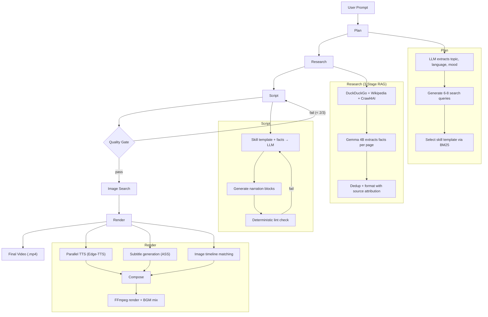

# Video Maker

An AI-powered pipeline that transforms a text prompt into a fully rendered YouTube Shorts video — complete with narration, subtitles, relevant images, and background music. No manual intervention required.

**Input:** `"Dandadan strongest supernatural beings"`  
**Output:** A 1080x1920 vertical video with TTS narration, timed subtitles, topic-matched images, and mood-based BGM.

---

## Pipeline



---

## How It Works

### 1. Planning
Parses free-form text into structured metadata (topic, language, content type, mood, search queries) using a lightweight LLM call with heuristic fallbacks.

### 2. Research — 3-Stage RAG Pipeline
| Stage | What | Why |
|-------|------|-----|
| **Search + Crawl** | DuckDuckGo (12 queries) + Wikipedia + Crawl4AI with BM25ContentFilter | Gather raw content from diverse sources |
| **LLM Extraction** | Gemma 3 4B reads each page and extracts topic-specific facts | Chunking destroys entity context — full-page extraction prevents fact contamination |
| **Dedup + Format** | Remove duplicates, tag with relevance scores | Clean structured facts ready for script writing |

**Why not standard RAG chunking?** Splitting pages into 500-char chunks and indexing with BM25 caused fact contamination — chunks about related but wrong characters ranked higher than the target. LLM extraction reads full page context and extracts only what's relevant.

### 3. Script Writing with Skill Templates
The system matches the prompt to a video type template (`skills/*.json`) using BM25:

| Template | Style |
|----------|-------|
| `dark_secrets` | Escalating shock, conspiracy tone |
| `did_you_know` | Curiosity triggers, revelation pacing |
| `top_list` | Numbered countdown with "#1 reveal" |
| `theory` | Debate framing, evidence presentation |
| `comparison` | X vs Y with dramatic winner reveal |
| `lore_deep_dive` | Worldbuilding, connected details |

Each template defines hook rules, pacing, tone, transitions, and prompt instructions injected into the LLM call.

### 4. Quality Gate
3-question LLM evaluation (viral suitability, pacing, language). Fails trigger a script rewrite with targeted feedback — one of two feedback loops in the pipeline.

### 5. Image Search + Timeline Matching
Images are searched per-block using `image_keywords` from the script, then **sorted to match narration chronology**:

```
keyword[0] = "Takaba manga panel"          → narration start
keyword[1] = "Hazenoki defeated"           → middle  
keyword[2] = "funeral scene"               → narration end

Images sorted by keyword index → appear when narrator mentions them
```

No ML model needed — substring matching on image metadata, <10ms for 30 images.

### 6. Render
- **TTS:** Edge-TTS with parallel sentence chunking (up to 5 concurrent calls), PCM concatenation for gapless audio
- **Subtitles:** ASS format with phrase-level segmentation, keyword highlighting, timing guardrails
- **Video:** Two modes — popup overlays or full-screen Ken Burns pan. FFmpeg composition with mood-based BGM mixing

---

## Key Design Decisions

| Decision | Alternative Rejected | Reason |
|----------|---------------------|--------|
| Gemma 4B for extraction | Gemma 12B/27B | Zero rate limits on free tier; 12B returns 503s constantly |
| BM25 over CLIP for image matching | CLIP/SigLIP | CLIP needs 2-4GB VRAM; BM25 runs in <10ms on CPU |
| Edge-TTS word boundaries | Whisper forced alignment | Whisper base drifts 43s on Vietnamese; Edge-TTS = 0.000s drift |
| PIL pre-compose → rawvideo pipe | FFmpeg N-overlay filter chain | 12-overlay chain: 407s. PIL pipe: 14.8s. **27.5x faster** |
| Per-page LLM extraction | RAG chunk + retrieve | Chunking destroys entity co-occurrence → fact contamination |
| PCM array concat | FFmpeg MP3 `-c copy` | MP3 frame alignment creates inter-chunk silence gaps |

---

## Performance

| Metric | Before | After |
|--------|--------|-------|
| Render time | 407s | 14.8s (27.5x) |
| Subtitle drift | 43s | 0.000s |
| Research relevance | ~43% | 67-100% |
| TTS speed | baseline | 2.18x (parallel) |

---

## Tech Stack

| Component | Technology |
|-----------|-----------|
| LLM | Google Gemini (Gemma 4B/27B), Groq (Llama 3.3 70B) |
| TTS | Microsoft Edge-TTS |
| Video | FFmpeg (NVENC optional) |
| RAG | rank-bm25, fastembed (ONNX) |
| Web Crawling | Crawl4AI, DuckDuckGo |
| Image Processing | Pillow/PIL |
| Web UI | Flask |
| Validation | Pydantic |

---

## Project Structure

```
src/
  agent/              # Pipeline stages (plan, research, script, quality, image, render)
  content_sources/    # RAG index, web crawling, script writing, linting
  images/             # Image search and download pipeline
  manager.py          # Video rendering orchestrator
  editor.py           # FFmpeg composition, subtitle generation
  tts.py              # Edge-TTS with parallel chunking
  llm_client.py       # Gemini/Groq with automatic failover
  web.py              # Flask web application
skills/               # JSON script templates (8 video types)
profiles/             # Video output configuration
templates/            # Web UI (Jinja2)
static/               # Frontend CSS/JS
assets/               # BGM, sound effects, background videos
```

---

## Setup

```bash
# Prerequisites: Python 3.13+, FFmpeg

# Install dependencies
pip install -r requirements.txt

# Set API keys in .env
GEMINI_API_KEY=your_key
GROQ_API_KEY=your_key

# Run web UI
python -m src.web
# Open http://localhost:5000
```

---

## Architecture Notes

This is a **fixed sequential pipeline**, not an agent system. The stages always run in the same order: plan → research → script → quality gate → images → render. The code uses `*_agent.py` naming by convention, but these are pipeline stages — they don't make autonomous decisions about what to do next.

Two feedback loops exist:
1. **Script lint → rewrite:** Failed lint injects specific feedback into the next LLM call
2. **Quality gate → rewrite:** Failed quality check triggers script regeneration

Everything else is a forward pass with fallback chains for robustness.
