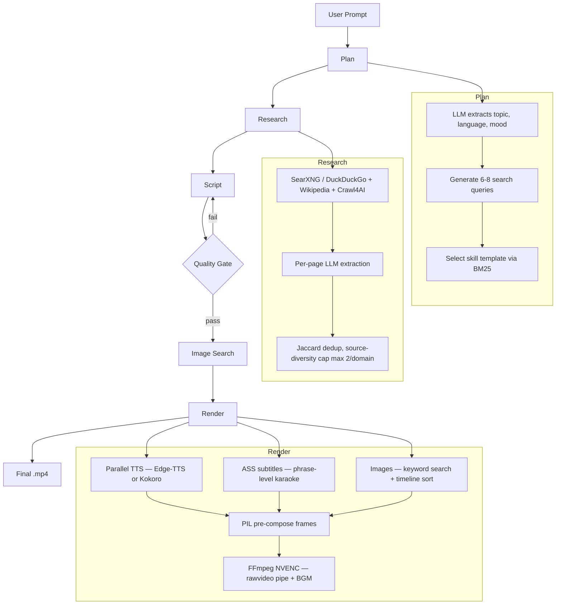

# 🎬 AI Video Generation System

> Turn a text prompt into a finished, rendered vertical video — narration, word-timed subtitles, matched visuals, and background music — fully automated.


Two production pipelines from one codebase: **scraped-image anime/lore Shorts** and **stock-footage psychology Shorts** rendered via Remotion. Plus long-form and podcast formats. The LLM writing runs through Claude Code skills; thin Python scripts handle TTS, visuals, and compositing.

---

## Contents

- [Demos](#demos)
- [How it works](#how-it-works)
- [Tech stack](#tech-stack)
- [Pipelines](#pipelines)
- [Engineering highlights](#engineering-highlights)
- [Architecture](#architecture)
- [Setup & usage](#setup--usage)
- [Repo layout](#repo-layout)

---

## Demos

Both clips play **inline with audio** below — rendered straight from the pipelines, no manual editing.

| 🧠 B-roll — Psychology Facts Short | 🎴 Anime — Lore / Character Short |
|:---:|:---:|
| <video src="https://github.com/user-attachments/assets/1e335e15-fbac-414c-ad3f-5d04244b929a" controls width="320"></video> | <video src="https://github.com/user-attachments/assets/7ae66b29-73d9-4d8c-9e4d-a700f0f796f3" controls width="320"></video> |
| _"Why you replay arguments in your head"_ | _"Light Yagami / Death Note"_ |
| stock-footage pipeline · ~33s | scraped-image pipeline · ~41s |

---

## How it works

A free-form prompt enters one of two pipelines and exits as a **1080×1920** vertical video with narration, word-timed subtitles, and mood-matched BGM.

| | 🎴 Anime / Lore Short | 🧠 B-roll Psychology Short |
|---|---|---|
| **Example input** | `"Light Yagami / Death Note"` | `"Why you replay arguments in your head"` |
| **Research** | SearXNG/DDG + Wikipedia + Crawl4AI | beat-segmented script |
| **Visuals** | scraped web images, timeline-sorted | Pexels stock clips, SigLIP-reranked |
| **Compose** | PIL → rawvideo pipe → FFmpeg | FFmpeg + Remotion (square clip on paper bg) |
| **Captions** | ASS karaoke subtitles | Remotion animated caption cards |
| **TTS** | Edge-TTS / Kokoro-ONNX | Kokoro-ONNX |
| **Output** | 1080×1920 · ~40s | 1080×1920 · ~33s |

---

## Tech stack

| Area | Stack |
|---|---|
| **Language** | Python 3.13 |
| **LLM** | Groq (Llama-3.3-70B, Llama-3.1-8B-instant) + Google Gemini (Gemma-3-27B); multi-provider failover, routing in `profiles/default.json`, zero hardcoded model names |
| **Research** | SearXNG (self-hosted, primary) → DuckDuckGo fallback, Wikipedia, Crawl4AI; BM25 page scoring (`rank-bm25`) |
| **Vision** | SigLIP perceptual frame reranking (`transformers` + `torch`); `fastembed` dense embeddings |
| **TTS** | Kokoro-ONNX (local), Edge-TTS (cloud), Chatterbox (voice cloning); parallel chunking, PCM-level concat |
| **Video** | FFmpeg (NVENC + libx264 fallback); PIL pre-compose → rawvideo pipe; ASS subtitles; mood-based BGM mixing |
| **Render UI** | Remotion (React / TypeScript) — animated caption compositions |
| **Stock media** | Pexels Videos API |
| **Orchestration** | Claude Code skills (`/broll`, `/writer`, `/long-video`) + thin `scripts/` render entry points |

---

## Pipelines

### 🎴 Anime / Lore Shorts


```mermaid
flowchart TD
    A[User Prompt] --> B[Plan]
    B --> C[Research]
    C --> D[Script]
    D --> E{Quality Gate}
    E -- "fail" --> D
    E -- "pass" --> F[Image Search]
    F --> G[Render]
    G --> H[Final .mp4]

    subgraph Plan
        B1[LLM extracts topic, language, mood] --> B2[Generate 6-8 search queries]
        B2 --> B3[Select skill template via BM25]
    end
    B --> B1

    subgraph Research
        C1[SearXNG / DuckDuckGo + Wikipedia + Crawl4AI] --> C2[Per-page LLM extraction]
        C2 --> C3[Jaccard dedup, source-diversity cap max 2/domain]
    end
    C --> C1

    subgraph Render
        G1[Parallel TTS — Edge-TTS or Kokoro] --> G4[PIL pre-compose frames]
        G2[ASS subtitles — phrase-level karaoke] --> G4
        G3[Images — keyword search + timeline sort] --> G4
        G4 --> G5[FFmpeg NVENC — rawvideo pipe + BGM]
    end
    G --> G1
    G --> G2
    G --> G3
```

<details>
<summary><b>🧠 B-roll Psychology Shorts</b> (<code>src/broll/</code>) — click to expand</summary>


```mermaid
flowchart LR
    A[Topic prompt] --> B[Write beat-segmented script\nkeywords.write_script]
    B --> C[Generate per-beat visual queries\nkeywords.visual_queries]
    C --> D[Fetch portrait clips from Pexels\nclip_source.search_clips]
    D --> E[SigLIP frame rerank + cross-beat dedup\nrerank.rerank_pool]
    E --> F[FFmpeg: cut + fit square segments\nclip_source.fill_segment]
    F --> G[Concat beat backgrounds\ncompose.concat_background]
    G --> H[Remotion render\npaper bg + square clip + karaoke hook]
    H --> I[Mux Kokoro-ONNX narration]
    I --> J[Mix BGM]
    J --> K[Final .mp4 + YouTube metadata]
```

</details>

---

## Engineering highlights

**⚡ Performance**
- **27.5× faster rendering** — PIL pre-compose to rawvideo pipe (14.8s) vs an FFmpeg N-overlay filter chain (407s).
- **Zero subtitle drift** — Edge-TTS word-boundary timestamps vs Whisper forced alignment (0.000s vs 43s drift on Vietnamese).
- **PCM-level audio concat** — WAV frames joined at raw PCM level, eliminating inter-chunk silence from MP3 frame alignment.

**🔎 Research quality**
- **Per-page LLM extraction** — full page text to the extraction LLM instead of chunk + BM25 retrieval, which destroyed entity co-occurrence and contaminated facts.
- **Source-diversity cap** — `max_per_source=2` stops one comprehensive domain from monopolizing the fact pool, surfacing minority facts.
- **Multi-provider failover** — 9 stages routed Groq → Gemini via `profiles/default.json`; auto-retry on 429/503; no model names hardcoded in source.

**🎯 B-roll visual matching**
- **SigLIP perceptual rerank** — each Pexels candidate scored frame-by-frame against its query; best-frame offset becomes the clip start; graceful fallback if torch/model is absent.
- **Keyword-first ranking** — visual queries define a per-topic "visual world" so figurative language doesn't mismatch footage (`"rat race"` → commuters, not a rodent).
- **Cross-beat dedup** — a running `used_ids` set prevents repeated clips; forced reuse gets varied start offsets so frames still differ.
- **Remotion animated captions** — phrase chunking, auto-shrink-to-fit, minimum display time, per-word highlight; concurrency 12, no GPU required.

---

## Architecture

Thin render scripts (`scripts/`) sit over shared `src/` modules — entry points, not monoliths.

- **Anime/lore** follows `research → script → quality-gate → image → editor`.
- **B-roll** is orchestrated by `src/broll/builder.py`.
- **Script writing** is handled by Claude Code skills (`/writer`, `/broll`, `/long-video`) — no external LLM key needed to write a script from a skill. The optional Groq/Gemini routing powers standalone research/extraction and never hardcodes model names.
- The original API-driven pipeline and Flask web UI are preserved under `archive/` for reference.

---

## Setup & usage

```bash
python -m venv .venv
.venv/bin/pip install -r requirements.txt

cd remotion && npm install   # Remotion deps (b-roll / podcast only)
```

Add API keys to `.env` at the project root:

```bash
GEMINI_API_KEY=...
GROQ_API_KEY=...
PEXELS_API_KEY=...   # b-roll pipeline only
```

**Render a b-roll Psychology Short:**

```bash
.venv/bin/python scripts/render_broll.py --topic "Why you replay arguments in your head"
```

**Render an anime/lore Short** from a written script (the `/writer` skill produces `script.json`):

```bash
.venv/bin/python scripts/render_script.py output/runs/<run>/script.json my_short
```

> Heavy assets (BGM, Pexels clip cache, Remotion `node_modules`, Kokoro ONNX weights) are gitignored and fetched/installed separately. A full render needs FFmpeg on PATH; NVENC is used when an NVIDIA GPU is present, with a libx264 CPU fallback.

---

## Repo layout

```
scripts/            # Render entry points (render_script, render_broll, render_novel, render_podcast …)
src/
  agent/            # research_agent, editor_agent, image_agent, long_editor, conversation_writer, rag_store
  broll/            # B-roll pipeline: builder, keywords, clip_source, rerank (SigLIP), compose, remotion_render
  images/           # Image fetch, SigLIP matcher, anime filter, pipeline
  content_sources/  # Web crawl + SearXNG source
  tts.py            # Edge-TTS + Kokoro-ONNX + Chatterbox backends
  editor.py         # Anime Short composer (PIL + FFmpeg)
  llm_client.py     # Groq/Gemini client with failover
  agent_config.py   # Stage-model routing, profile loader
  thumbnail.py      # YouTube thumbnail generator
remotion/           # React/TypeScript Remotion compositions (BrollShort, Conversation)
skills/             # Script format + style templates (_styles/, fact_dump, novel_summary)
prompts/            # Writing briefs + LLM prompt templates
profiles/           # default.json — model routing, TTS config, render tuning
archive/            # Legacy API-driven pipeline + Flask web UI (reference only)
output/             # Per-run artifacts (runs/) and final videos (videos/)
```

---

## License

Proprietary — built as a portfolio project.
