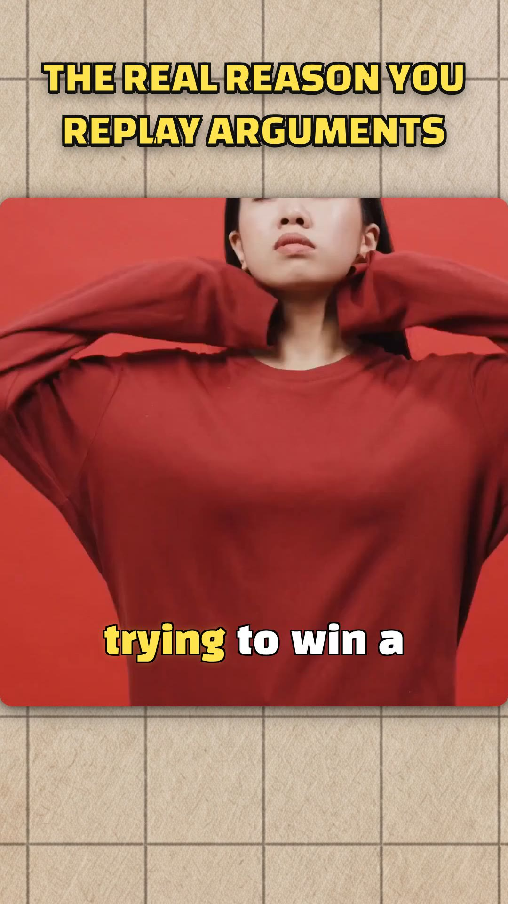
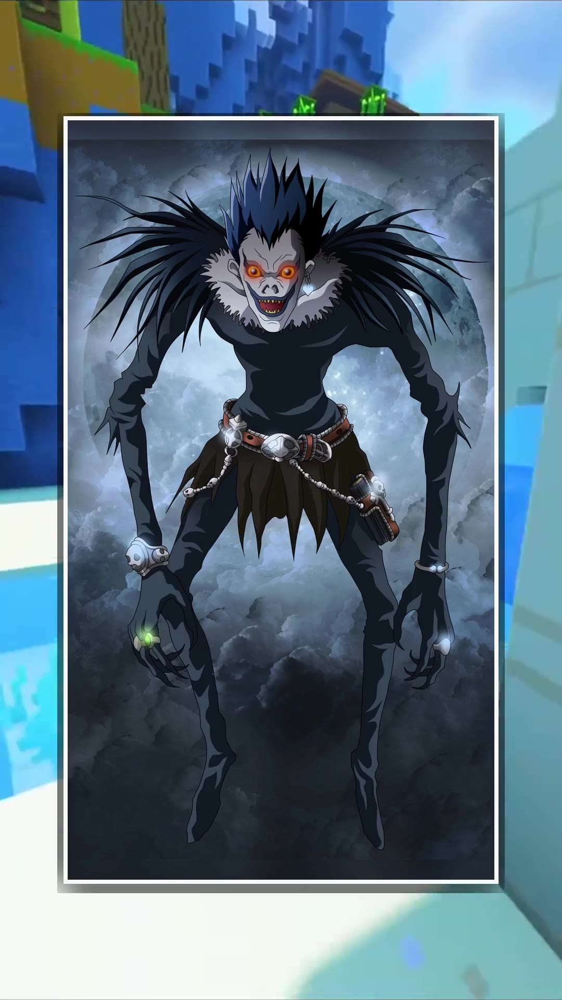
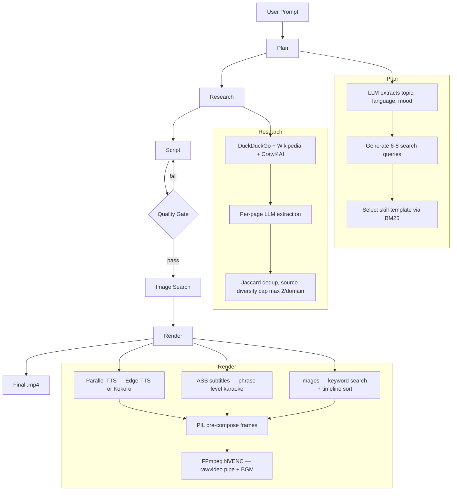

# AI Video Generation System

Turns a text prompt into a finished, rendered vertical video — narration, timed subtitles, visuals, and background music — fully automated. Two distinct pipelines: one for scraped-image anime/lore Shorts, one for stock-footage psychology Shorts rendered via Remotion.

---

## Demos

Click a thumbnail to play the rendered .mp4.

| B-roll — Psychology Facts Short | Anime — Lore/Character Short |
|---|---|
| [](docs/demos/broll_psychology_short.mp4) | [](docs/demos/anime_lore_short.mp4) |
| Stock footage pipeline · ~45s Short | Scraped-image pipeline · ~50s Short |

---

## What it does

A free-form text prompt enters one of two pipelines and exits as a 1080×1920 vertical video with word-timed subtitles, narration, and mood-matched BGM. The **anime/lore pipeline** researches the topic via DuckDuckGo + Wikipedia + Crawl4AI, writes a narration with a style template, retrieves and timeline-sorts scraped images, then composes via PIL → rawvideo pipe → FFmpeg. The **b-roll psychology pipeline** writes a beat-segmented script, fetches portrait stock clips from Pexels, reranks them with SigLIP frame embeddings, and composes a square-clip-on-paper-background Short via Remotion (React/TypeScript). Long-form (10–15 min chapters) and podcast (16:9 Remotion) formats also exist.

---

## Tech Stack

**Language** — Python 3.13

**AI / LLM** — Groq (Llama-3.3-70B, Llama-3.1-8B-instant) + Google Gemini (Gemma-3-27B) with automatic multi-provider failover; all routing in `profiles/default.json`, zero hardcoded model names

**TTS** — Kokoro-ONNX (local, English Shorts), Edge-TTS (Microsoft cloud, Vietnamese + fallback English), Chatterbox (voice cloning); parallel sentence chunking with PCM-level concat

**Video / Audio** — FFmpeg (NVENC hardware encode, libx264 CPU fallback); PIL pre-compose → rawvideo pipe; Remotion (React/TypeScript) for animated caption compositions; ASS subtitle format; mood-based BGM mixing

**Retrieval / Research** — DuckDuckGo, Wikipedia, Crawl4AI; BM25 page scoring and skill-template selection (`rank-bm25`); SigLIP (`transformers` + `torch`) for perceptual clip reranking; `fastembed` for dense embeddings; Pexels Videos API for stock footage

**Frontend / Render** — Remotion (`BrollShort` composition: paper background + 1080×1080 square clip + Changa One karaoke captions)

**Orchestration** — Claude Code skills (`/broll`, `/writer`, `/long-video`) handle the LLM writing stage; thin Python render scripts under `scripts/` drive TTS + visuals + compose

---

## Pipeline / Flow

### Anime / Lore Shorts


```mermaid
flowchart TD
    A[User Prompt] --> B[Plan]
    B --> C[Research]
    C --> D[Script]
    D --> E{Quality Gate}
    E -- "fail" --> D
    E -- "pass" --> F[Image Search]
    F --> G[Render]
    G --> H[Final .mp4]

    subgraph Plan
        B1[LLM extracts topic, language, mood] --> B2[Generate 6-8 search queries]
        B2 --> B3[Select skill template via BM25]
    end
    B --> B1

    subgraph Research
        C1[DuckDuckGo + Wikipedia + Crawl4AI] --> C2[Per-page LLM extraction]
        C2 --> C3[Jaccard dedup, source-diversity cap max 2/domain]
    end
    C --> C1

    subgraph Render
        G1[Parallel TTS — Edge-TTS or Kokoro] --> G4[PIL pre-compose frames]
        G2[ASS subtitles — phrase-level karaoke] --> G4
        G3[Images — keyword search + timeline sort] --> G4
        G4 --> G5[FFmpeg NVENC — rawvideo pipe + BGM]
    end
    G --> G1
    G --> G2
    G --> G3
```

### B-roll Psychology Shorts (`src/broll/`)


```mermaid
flowchart LR
    A[Topic prompt] --> B[Write beat-segmented script\nkeywords.write_script]
    B --> C[Generate per-beat visual queries\nkeywords.visual_queries]
    C --> D[Fetch portrait clips from Pexels\nclip_source.search_clips]
    D --> E[SigLIP frame rerank + cross-beat dedup\nrerank.rerank_pool]
    E --> F[FFmpeg: cut + fit square segments\nclip_source.fill_segment]
    F --> G[Concat beat backgrounds\ncompose.concat_background]
    G --> H[Remotion render\npaper bg + square clip + karaoke hook]
    H --> I[Mux Kokoro-ONNX narration]
    I --> J[Mix BGM]
    J --> K[Final .mp4 + YouTube metadata]
```

---

## Engineering Highlights

- **27.5x faster rendering** — PIL pre-compose to rawvideo pipe (14.8s) vs FFmpeg N-overlay filter chain (407s) for the anime pipeline
- **Zero subtitle drift** — Edge-TTS word-boundary timestamps vs Whisper forced alignment (0.000s vs 43s drift on Vietnamese)
- **PCM-level audio concat** — WAV frames concatenated at the raw PCM level, eliminating inter-chunk silence from MP3 frame alignment on both pipelines
- **Multi-provider LLM failover** — 9 pipeline stages routed across Groq → Gemini via `profiles/default.json`; automatic retry on 429/503; no hardcoded model names anywhere in source
- **Per-page LLM extraction** — Full page text sent to extraction LLM rather than chunked + BM25 retrieved; chunking destroyed entity co-occurrence and caused fact contamination
- **Source diversity cap** — `max_per_source=2` prevents a comprehensive domain from monopolizing the fact pool, surfacing minority facts from smaller sources
- **SigLIP perceptual clip rerank** — Each Pexels candidate is scored frame-by-frame against its own query string using SigLIP embeddings; best-frame offset is recorded and used as the clip start point; graceful fallback to unranked pool if torch/model unavailable
- **Keyword-first clip ranking** — Visual query generation explicitly defines a per-topic "visual world" to prevent figurative language from producing mismatched footage ("rat race" → commuters, not a rat)
- **Cross-beat dedup** — Running `used_ids` set across beats prevents the same Pexels clip from repeating; later beats get varied start offsets on forced reuse so frames still differ
- **Remotion animated captions** — React/TypeScript `BrollShort` composition: sentence-split phrase chunking, auto-shrink font to fit one line, minimum card display time to prevent flash, per-word yellow highlight with dark outline; concurrency=12, no GPU required

---

## Architecture Notes

Thin render scripts (`scripts/`) over shared `src/` modules — the scripts are entry points, not monoliths. The anime/lore pipeline follows a `research → script → quality-gate → image → editor` flow; the b-roll pipeline is orchestrated by `src/broll/builder.py`. The script-writing stage is driven by Claude Code skills (`/writer`, `/broll`, `/long-video`) — so no external LLM API key is needed to write a script when running from a skill; the optional Groq/Gemini routing in `profiles/default.json` powers the standalone research/extraction stages and never hardcodes model names. The original API-driven pipeline and Flask web UI are preserved under `archive/` for reference.

---

## Setup

```bash
python -m venv .venv
.venv/bin/pip install -r requirements.txt

# Remotion (b-roll pipeline only)
cd remotion && npm install

# API keys in .env at project root
GEMINI_API_KEY=...
GROQ_API_KEY=...
PEXELS_API_KEY=...   # required for b-roll pipeline only
```

Render a b-roll Psychology Short end-to-end:

```bash
.venv/bin/python scripts/render_broll.py --topic "Why you replay arguments in your head"
```

Render an anime/lore Short from a written script (the `/writer` Claude Code skill produces the `script.json`):

```bash
.venv/bin/python scripts/render_script.py output/runs/<run>/script.json my_short
```

Heavy assets (BGM files, Pexels clip cache, Remotion `node_modules`, Kokoro ONNX model weights) are gitignored and fetched/installed separately. A full render uses FFmpeg on PATH; NVENC is used when an NVIDIA GPU is present, with a libx264 CPU fallback.

---

## Repo Layout

```
scripts/            # Render entry points (render_script.py, render_broll.py,
                    #   render_novel.py, render_podcast.py, render_from_run.py)
src/
  agent/            # research_agent, editor_agent, image_agent, long_editor,
                    #   conversation_writer, rag_store, grounding
  broll/            # B-roll pipeline: builder, keywords, clip_source,
                    #   rerank (SigLIP), compose, remotion_render
  images/           # Image fetch, SigLIP matcher, anime filter, pipeline
  content_sources/  # Web crawl + SearXNG image source
  tts.py            # Edge-TTS + Kokoro-ONNX + Chatterbox backends
  editor.py         # Anime Short composer (PIL + FFmpeg)
  llm_client.py     # Groq/Gemini client with failover
  agent_config.py   # Stage-model routing, profile loader
  thumbnail.py      # YouTube thumbnail generator
remotion/           # React/TypeScript Remotion compositions (BrollShort, Conversation)
skills/             # Script format + style templates (_styles/, fact_dump, novel_summary)
prompts/            # Externalized writing briefs + LLM prompt templates
profiles/           # default.json — model routing, TTS config, render tuning
archive/            # Legacy API-driven pipeline + Flask web UI (reference only)
output/
  runs/             # Per-run artifacts: plan.json, research.json, script.json
  videos/           # Final rendered .mp4 files + thumbnails
```

---

## License

Proprietary. Built as a portfolio project.
