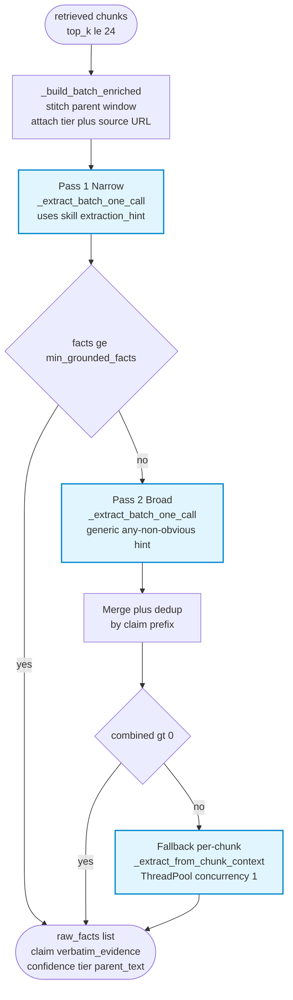
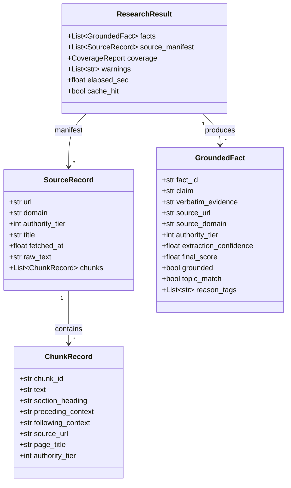
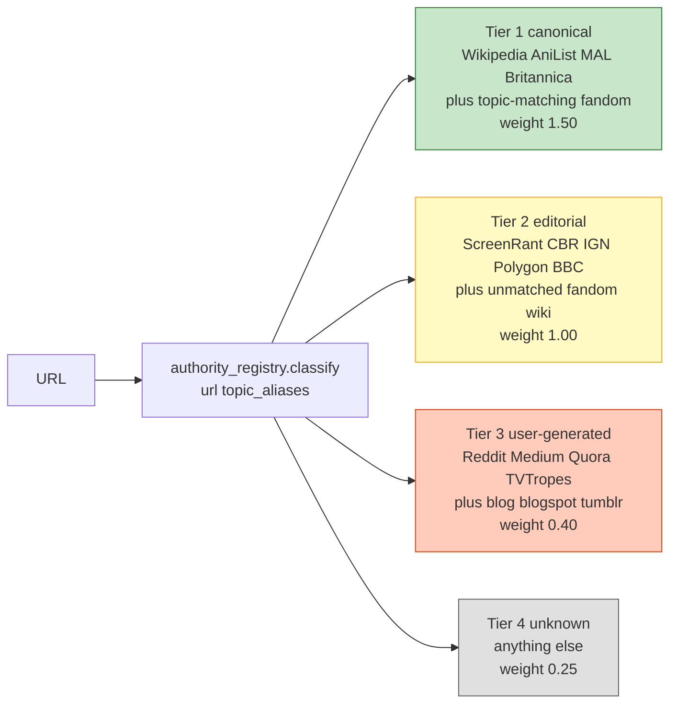

# Research Agent Flow

Visual reference for `src/agent/research_agent.py::run_research()`. Matches the code as of plan 02 + the post-critic batched-extraction work.

---

## 1 · Top-level pipeline

```mermaid
flowchart TD
    START([run_research]) --> CFG[Load research_settings<br/>forbidden_entities<br/>extraction_hint]

    CFG --> CACHE{RagStore.is_cached<br/>TTL 7 days}
    CACHE -- hit --> RCACHE[Retrieve top_k<br/>min_tier eq 2<br/>tier-weighted RRF]
    RCACHE --> EXTRACT
    CACHE -- miss --> EXPAND

    EXPAND[Stage 1: Query Expansion<br/>_expand_queries_llm<br/>prompt research_expand_queries.txt]
    EXPAND --> ACQ

    subgraph ACQ [Stage 2 Acquisition]
        direction LR
        DDG[_phase_search<br/>DuckDuckGo x N queries]
        WIKI[_phase_wiki<br/>Wikipedia target plus English]
        CRAWL[_crawl_with_soft_floor<br/>Crawl4AI plus BM25]
    end

    ACQ --> MERGE[Merge pages<br/>wiki plus crawled plus snippets]
    MERGE --> TIER[Stage 3 Tier Classification<br/>_classify_pages_by_tier<br/>authority_registry.classify]
    TIER --> CHUNK[Parent-aware Chunking<br/>_chunks_with_enrichment<br/>section heading plus prev next context]

    CHUNK --> INDEX[Stage 4 RAG Index<br/>ChromaDB upsert<br/>metadata tier heading context chunk_idx]
    INDEX --> RETRIEVE[Stage 5 Hybrid Retrieval<br/>retrieve_queries x 4 to 5<br/>tier-weighted RRF<br/>min_tier filter]

    RETRIEVE --> EXTRACT[Stage 6 Batched Extraction<br/>see diagram 2]

    EXTRACT --> CONTAM[Stage 6b Contamination Filter<br/>is_contaminated vs forbidden_entities]
    CONTAM --> GROUND[Stage 7 Grounding plus Scoring<br/>_verify_grounding]

    GROUND --> RANK[_score_and_rank_facts<br/>sort by final_score desc<br/>Jaccard 0.5 dedup<br/>cap at max_final_facts]
    RANK --> FLOOR{_check_quality_floor<br/>6 plus grounded<br/>2 plus domains at tier le 2}

    FLOOR -- met --> PERSIST
    FLOOR -- unmet and iter lt 2 --> GAP

    subgraph GAP [Stage 8 Gap-fill Loop]
        direction TB
        E1[_phase_evaluate<br/>LLM missing angles]
        E2[_phase_reflect_crawl<br/>new DDG plus crawl]
        E3[Tier-tag plus chunk new pages]
        E4[Batched extract<br/>same _extract_batch_one_call]
        E5[Contamination plus grounding plus rank]
        E1 --> E2 --> E3 --> E4 --> E5
    end

    GAP --> FLOOR
    FLOOR -- iter maxed still unmet --> WARN[Emit warning<br/>Quality floor unmet]

    WARN --> PERSIST
    PERSIST[_store_to_bank<br/>content_bank persistence] --> BUILD[_build_legacy<br/>set _last_result]
    BUILD --> RETURN([Return legacy dict<br/>facts sources_used<br/>warnings coverage])

    classDef llm fill:#e1f5ff,stroke:#0288d1,stroke-width:2px
    classDef filter fill:#fff3e0,stroke:#f57c00,stroke-width:2px
    classDef cache fill:#f3e5f5,stroke:#7b1fa2,stroke-width:2px
    classDef gate fill:#ffebee,stroke:#c62828,stroke-width:2px
    class EXPAND,EXTRACT,E1,E4 llm
    class CONTAM,GROUND filter
    class CACHE,INDEX,RCACHE cache
    class FLOOR gate
```

**Legend**
- Blue = LLM call (counts against rate limit)
- Orange = filter / verification gate
- Purple = RAG cache operation
- Red = quality gate (decides gap-fill)

---

## 2 · Batched extraction (Stage 6 zoom)

**Why batched:** gemma-4-31b-it has a 256K context window. Sending all 24 chunks in one call collapses the old per-chunk pattern (12–24 LLM calls) into 1–2, bypassing Gemini free tier's 15 RPM cap. The LLM tags each fact with `chunk_index` so we can route it back to the right parent for grounding verification.

---

## 3 · Key data contracts

**Field notes (not in diagram):**
- `ChunkRecord.preceding_context` — last ~120 chars of the previous chunk
- `ChunkRecord.following_context` — first ~120 chars of the next chunk
- `GroundedFact.verbatim_evidence` — must be ≥30 chars and appear in the parent text
- `GroundedFact.final_score` = `extraction_confidence * tier_weight(tier)`

---

## 4 · Authority tier weights

`final_score = extraction_confidence × tier_weight(tier)` — a tier-4 fact with 0.9 confidence (score 0.225) loses to a tier-1 fact with 0.7 confidence (score 1.05).

---

## 5 · Budget accounting (per fresh run)

| Stage | LLM calls | Model / stage | Typical tokens |
|---|---|---|---|
| 1 — Query expansion | 1 | `research_eval` (llama-3.1-8b) | ~400 in, ~200 out |
| 6 — Narrow batch extraction | 1 | `research_extract` (gemma-4-31b-it, `/no_think`) | ~6-12k in, ~1k out |
| 6 — Broad batch extraction (fallback) | 0-1 | same | same |
| 8 — Gap-fill evaluate | 0-1 | `research_eval` | ~200 in, ~100 out |
| 8 — Gap-fill batch extraction | 0-1 | `research_extract` | ~4-8k in, ~1k out |

**Total: 2–5 LLM calls per fresh run.** Comfortably under Gemini free tier's 15 RPM.

Non-LLM I/O per fresh run: DDG × N queries, Wikipedia × 1-2 pages, Crawl4AI × `max_crawl_pages` (default 8), ChromaDB upsert + query.
